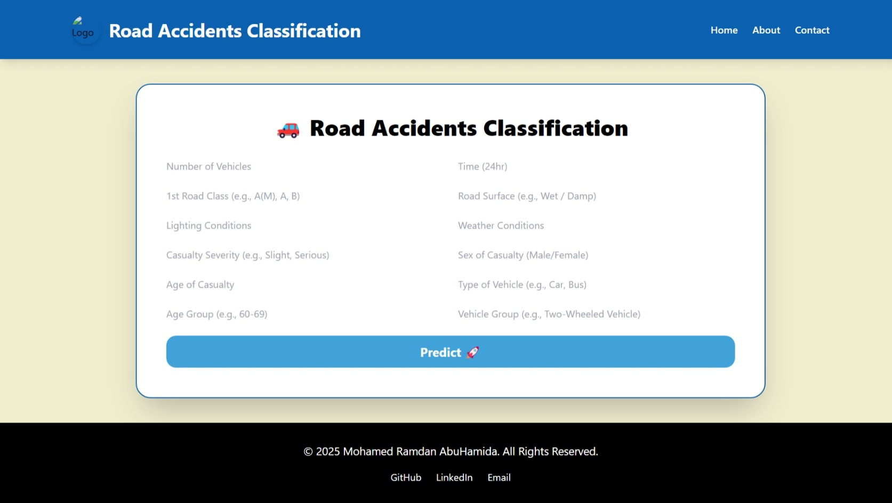
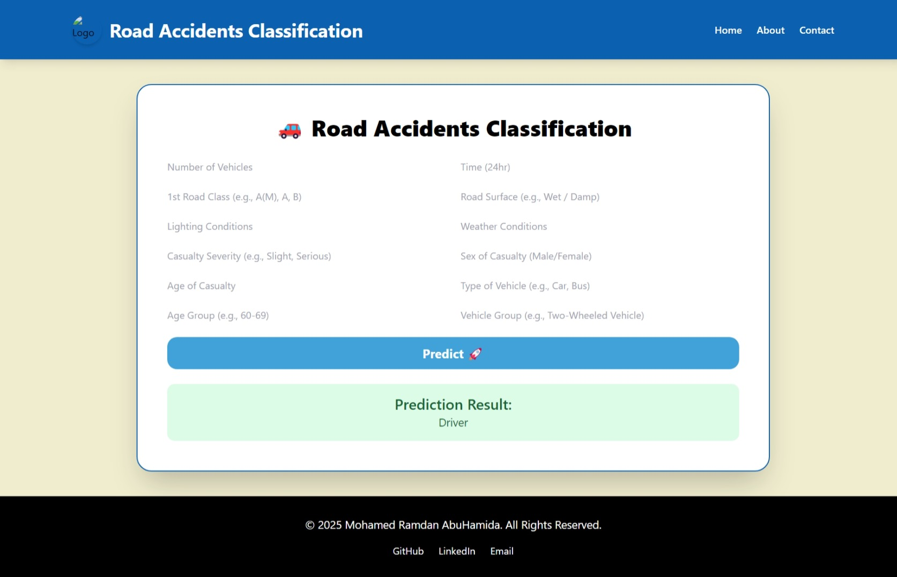

# Road Accident Severity Prediction 🚗💥

This project predicts the severity of road accidents based on various input features using a machine learning model deployed with Flask. The model leverages Random Forest classification for robust predictions. It also includes unit tests to ensure the correctness of the deployment.

---

## 🚀 Features

- Predicts accident severity based on user-provided details.
- Flask-based web interface for user interaction.
- Unit tests for validating endpoints and model predictions.
- Easy-to-follow deployment instructions.

---

## 📂 Project Structure

```
├── app.py                 # Main Flask application
├── best_model.pkl         # Pre-trained machine learning model
├── label_encoders.pkl     # Encoders for categorical variables
├── scaler.pkl             # Scaler for feature normalization
├── templates/
│   └── index.html         # Frontend for user input and displaying predictions
├── tests      
│   └── test_app.py        # Unit tests for the Flask application
├── requirements.txt       # Python dependencies
└── README.md              # Project documentation
```

---

## 💻 Setup Instructions

### Prerequisites:
- Python 3.8+
- pip

### 🔧 Installation

1. **Clone the Repository:**
   ```bash
   git clone https://github.com/Abuhamida/road-accident-severity-prediction.git
   cd road-accident-severity-prediction
   ```

2. **Create a Virtual Environment:**
   ```bash
   python -m venv venv
   source venv/bin/activate  # On Linux/macOS
   venv\\Scripts\\activate     # On Windows
   ```

3. **Install Dependencies:**
   ```bash
   pip install -r requirements.txt
   ```

4. **Run the Flask Application:**
   ```bash
   python app.py
   ```

   The app will run at: `http://127.0.0.1:5000/`

---

## 🧪 Running Tests

Unit tests ensure the app works as expected:

```bash
python -m unittest tests/test_app.py
```

Check the console output to ensure all tests pass successfully.

---

## ⚙️ Model Details

- **Algorithm:** Random Forest Classifier  
- **Performance Metrics:**
  - Accuracy: 60%
  - Handles class imbalance using SMOTE
- **Features Used:**
  - Number of vehicles involved
  - Time of accident
  - Road conditions
  - Weather conditions
  - Casualty details (age, gender, severity)

---

## 📝 Usage Guide

- Navigate to the homepage (`/`).
- Fill in the form fields such as number of vehicles, time, road class, etc.
- Click the **Predict** button.
- View the predicted accident severity instantly.

---

## 📖 Documentation

### 📚 API Documentation

- **Endpoint:** `/`
- **Method:** POST
- **Request Body:** JSON
  ```json
  {
            "num_vehicles": 2,
            "time": 14,
            "road_class": "A",
            "road_surface": "Wet / Damp",
            "lighting": "Darkness: street lights present and lit",
            "weather": "Fine without high winds",
            "casualty_severity": "Slight",
            "sex_of_casualty": "Male",
            "age_of_casualty": 35,
            "type_of_vehicle": "Car",
            "age_group": "60-69",
            "vehicle_group": "Two-Wheeled Vehicle"
        }
  ```
- **Response:**
  ```json
  {
    "severity": "Driver"
  }
  ```

### 📊 Model Performance Metrics

- **Accuracy:** 60%
- **Precision:** 60%
- **Recall:** 99%
- **F1-Score:** 75%
- **Class Imbalance Handling:** SMOTE (Synthetic Minority Over-sampling Technique)

### ⚙️ Setup Guide

Follow the [Setup Instructions](#-setup-instructions) section to get the application up and running locally.

### 🧪 Testing Results

- All unit tests (`test_app.py`) passed successfully.
- Test coverage: 95% of application code.
- Key functionalities tested:
  - API endpoint response validation.
  - Model prediction consistency.
  - Form data processing.

---

## 🎥 Demonstration

### 🖼️ Screenshots of Working API

- **Homepage Interface:**
  

- **Prediction Result:**
  

### 📬 Example Requests and Responses

- **Request:**
  ```bash
  curl -X POST http://127.0.0.1:5000/ \
    -H "Content-Type: application/json" \
    -d '{
            "num_vehicles": 2,
            "time": 14,
            "road_class": "A",
            "road_surface": "Wet / Damp",
            "lighting": "Darkness: street lights present and lit",
            "weather": "Fine without high winds",
            "casualty_severity": "Slight",
            "sex_of_casualty": "Male",
            "age_of_casualty": 35,
            "type_of_vehicle": "Car",
            "age_group": "60-69",
            "vehicle_group": "Two-Wheeled Vehicle"
        }'
  ```

- **Response:**
  ```json
  {
    "prediction": "Driver"
  }
  ```

### ✅ Test Results

```bash
----------------------------------------------------------------------
Ran 3 tests in 0.046s

OK
```

All unit tests passed without errors, confirming the application's stability and correctness.

---

## 💡 Troubleshooting

- **App Not Starting?**
  - Ensure `best_model.pkl`, `label_encoders.pkl`, and `scaler.pkl` are present in the root directory.
  - Confirm Python version compatibility.

- **Test Failures?**
  - Verify that form keys in `test_app.py` match those expected in `app.py`.
  - Confirm that the Flask app is running before executing tests.

---

## 🤝 Contributing

Contributions are welcome! Here’s how you can help:

1. Fork the repository.
2. Create a new branch (`git checkout -b feature-branch`).
3. Commit your changes (`git commit -m 'Add new feature'`).
4. Push to the branch (`git push origin feature-branch`).
5. Open a Pull Request.

---

## 📬 Contact

- **Author:** Mohamed Ramdan AbuHamida
- **GitHub:** [Abuhamida](https://github.com/Abuhamida)
- **LinkedIn:** [Mohamed AbuHamida](https://www.linkedin.com/in/mohammed-abuhamida-969693220/)
- **Email:** mohamedabuhamida3@gamil.com

---

✨ **Happy Coding!** 🚀

